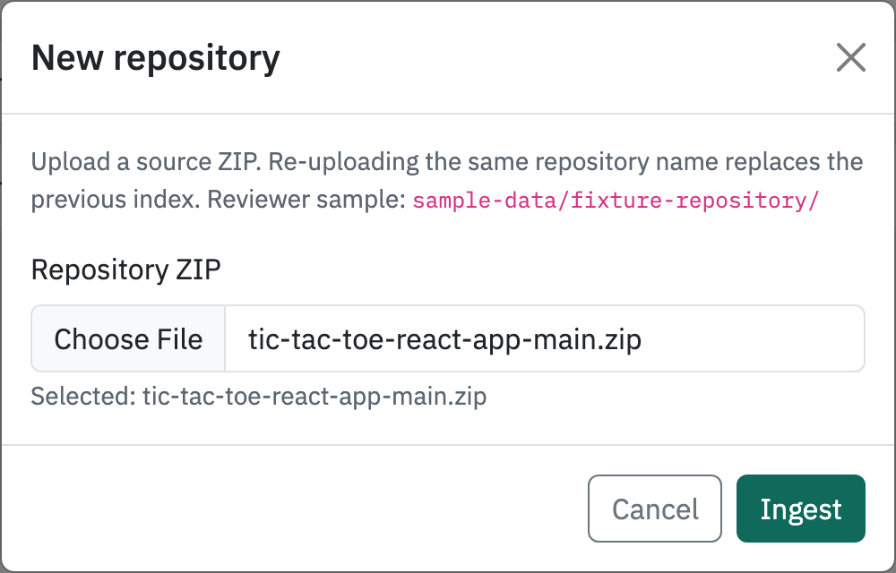
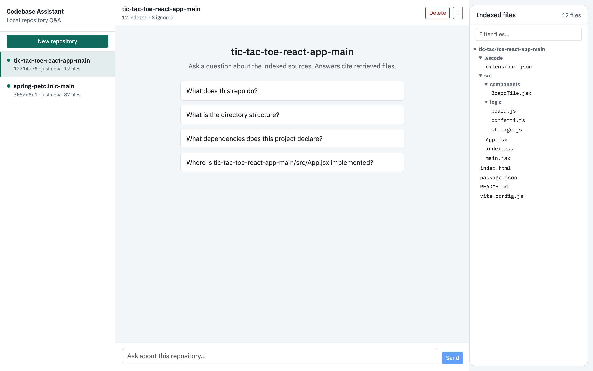
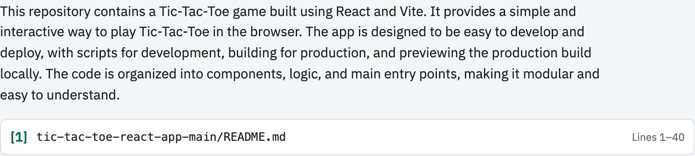
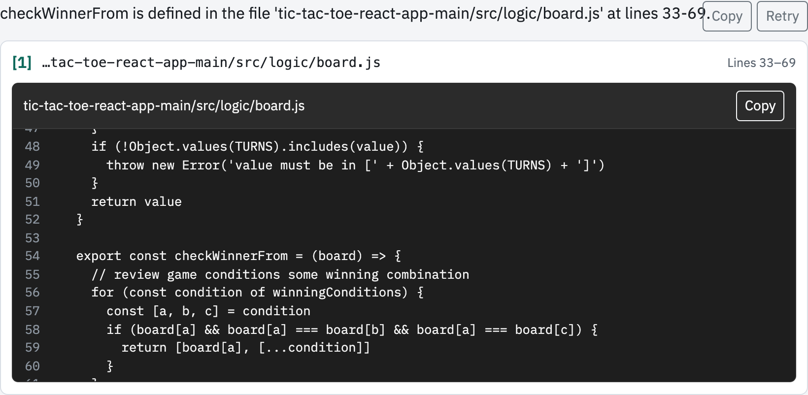
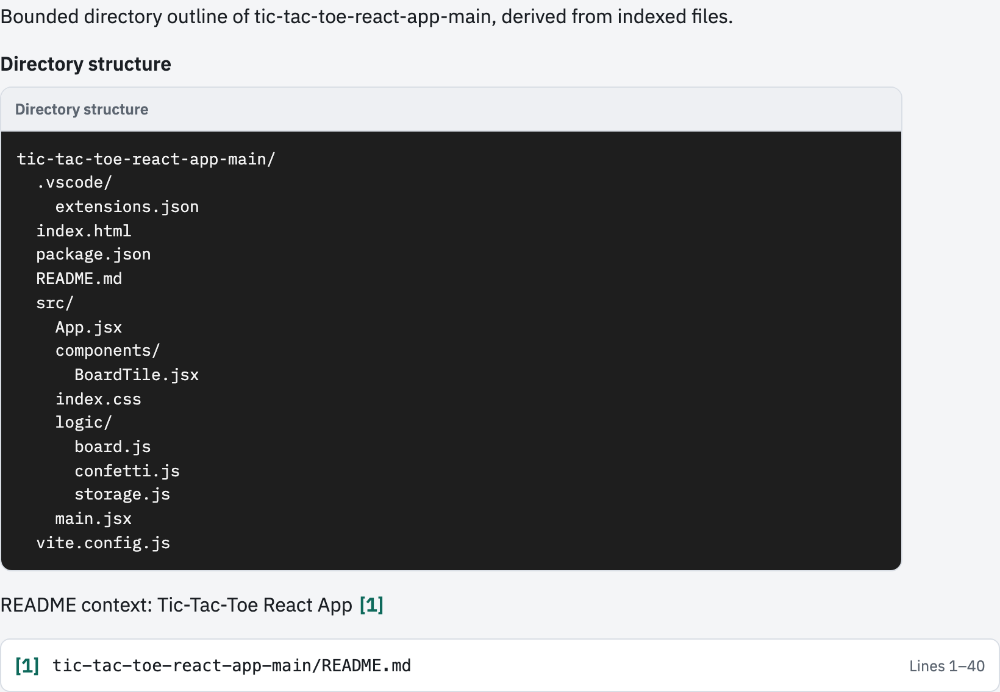
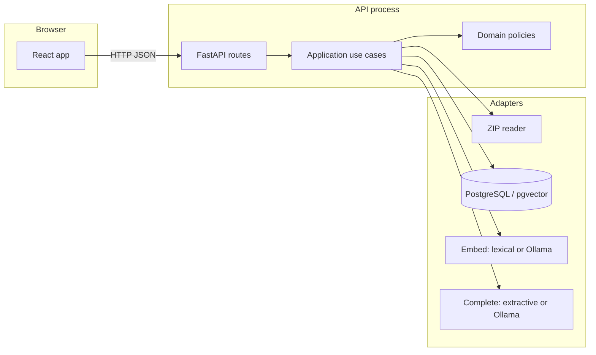
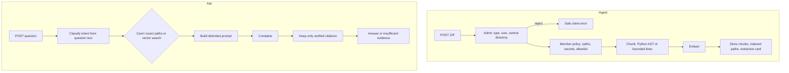

# Codebase Intelligence Assistant

Codebase Intelligence Assistant ingests a source-code ZIP and answers questions about the repository with citations verified against retrieved chunks. It is a portfolio project focused on secure ingestion, grounded retrieval, explicit architectural boundaries, and reproducible engineering practices.

Default runs stay offline: lexical embeddings and an extractive completer. Set `COMPLETION_PROVIDER=ollama` (and optionally `EMBEDDING_PROVIDER=ollama`) for local Ollama chat. Private repository text is not sent to a hosted LLM API ([ADR 004](docs/adr/004-ollama-local-inference.md)).

This is a modular monolith. Hermetic evaluation on the fixture is recorded in [docs/evaluation.md](docs/evaluation.md). Remaining operational gaps (API contracts, readiness, light logs) are listed in [PLAN.md](PLAN.md).

## Quick start

Two ways to run. Docker is the smallest first clone. Make is for a host Python/Node install against your own Postgres.

| Path | You already have | First commands |
|---|---|---|
| Docker | Docker Desktop (Engine + Compose v2) | `cp config/app.env.example config/app.env` then `docker compose --env-file config/app.env up -d --build` |
| Make | GNU Make, Python **3.14**, Node.js **24**, PostgreSQL 16 with pgvector | `make setup` then `make run` |

Windows PowerShell: `Copy-Item config\app.env.example config\app.env` if `cp` is missing.

Copy [config/app.env.example](config/app.env.example) to `config/app.env` before either path. An optional root `.env` overrides that file for host Make/manual runs. Default pytest stays hermetic and does not construct Ollama from those files.

### Docker (no Make)

```bash
cp config/app.env.example config/app.env
docker compose --env-file config/app.env up -d --build
```

- Web: http://localhost:3000
- API / OpenAPI: http://localhost:8000/docs
- Postgres: localhost **5433** (so a local server on 5432 can stay running)
- Ollama: localhost:11434

`docker compose up` does **not** pull models. For Ollama embeddings or chat, use `make setup && make run-docker`, which pulls tags required by `EMBEDDING_PROVIDER` / `COMPLETION_PROVIDER`.

```bash
docker compose --env-file config/app.env down
# or: make down
```

### Make (apps on the host)

Does **not** start Docker. Point `DATABASE_URL` in `config/app.env` or `.env` at your Postgres (usually port **5432**). Do not leave a Compose-only URL on 5433 unless that is the database you intend.

```bash
make setup    # venv, lockfile install, frontend npm ci, copy env if missing
make test     # hermetic unit/API/component tests
make run      # migrate, optional Ollama pull, API + Vite
```

Open http://localhost:3000 (Vite) and http://localhost:8000/docs.

If `EMBEDDING_PROVIDER` or `COMPLETION_PROVIDER` is `ollama`, a local Ollama process must already be running.

```bash
make test-integration   # needs Postgres
make down               # only stops Compose from make run-docker
```

`make help` lists every target.

## Try the product

1. Zip a small tree. The controlled fixture is [`sample-data/fixture-repository/`](sample-data/fixture-repository/):

   ```bash
   cd sample-data/fixture-repository && zip -r ../../fixture-repository.zip .
   ```

2. Open the app → **New repository** → upload the ZIP.
3. Confirm indexed vs ignored counts and the right-hand **Indexed files** tree (on small screens, **Files**).
4. Use a starter chip or ask `Where is list_items defined?` (present when `src/api/handlers.py` is indexed).
5. Open a citation. Excerpts are escaped text, not HTML.
6. **Delete** in the top bar removes that repository. **Re-index** is under ⋮.

Re-uploading the same ZIP basename (case-insensitive) replaces the previous index. `GET /api/repositories` lists stored summaries; `DELETE /api/repositories/{id}` removes a repository and its chunks.

Answers default to extractive (a cited line from retrieved context). Conversational answers need `COMPLETION_PROVIDER=ollama`.

## Screenshots

Live demo against `tmp/tic-tac-toe-react-app-main.zip` with local Ollama (`make run`). Playwright still covers the fixture journey, including insufficient evidence, via `make test-e2e`.

| Step | Question / state |
|---|---|
| Upload |  |
| Indexed files |  |
| Overview | “What does this repo do?”  |
| Locate + inspector | “Where is checkWinnerFrom defined?”  |
| Structure | “What is the directory structure?”  |

## Architecture

Ports and adapters at the edges. Domain and application code do not import FastAPI, SQLAlchemy or provider SDKs.



- **Domain:** source-file policy, chunks, citations, answer validation.
- **Application:** ingest and ask use cases; question intent; prompt construction.
- **Adapters:** HTTP, archive I/O, Postgres/pgvector, embedding and completion providers.
- **UI:** `frontend/src/app/` — upload, chat, citations, indexed file tree.

Layout that actually exists: `backend/src/codebase_assistant/` (`domain/`, `application/`, `adapters/`, `main.py`), `frontend/src/app/`, `compose.yaml`, `config/app.env.example`, `sample-data/`. HTTP lives in `main.py` (no separate `api/` package). Provider ports are `application/ports.py`.

Accepted decisions: [ADR 001](docs/adr/001-modular-monolith.md), [ADR 002](docs/adr/002-postgres-pgvector.md), [ADR 003](docs/adr/003-python-runtime.md) (Python 3.14), [ADR 004](docs/adr/004-ollama-local-inference.md).

## Request flow

Ingest and ask are separate use cases. Uploaded bytes are never executed.



Intent is deterministic (no model call): overview, structure, dependencies, endpoints, architecture flow, named code-unit details, locate, or explain. Overview / structure / dependencies / endpoints pin the extractive card and declaring files when that evidence exists; missing required evidence is insufficient evidence, not a random neighbour. Structure answers emit a bounded tree from indexed paths. Endpoint answers list extracted routes from the card and cite declaring files. Locate and explain use repository-scoped vector search; locate may pin chunks that contain a distinctive identifier when top-k missed it. Architecture-flow and code-unit questions load a bounded set of exact paths.

Supported indexed text includes common source and config suffixes (`.py`, `.js`/`.ts`/`.tsx`, `.java`, `.go`, `.md`, `.json`, `.toml`, and similar). Secrets, `node_modules`/`vendor`, lockfiles, minified bundles and binaries are ignored. A ZIP with no README, manifest or declared routes still indexes allowlisted files; overview/endpoint/dependency questions then return insufficient evidence instead of inventing structure.

| Kind | Supported | Not invented |
|---|---|---|
| Dependencies | `package.json`, PEP 621 `pyproject.toml`, `requirements.txt` | Lockfile graphs, Cargo, Go modules, Poetry/setup.py-only |
| Endpoints | Docstring `METHOD /path`; FastAPI/Flask/Starlette; Express `app.get`; Spring `@*Mapping` | Generated OpenAPI-only, runtime-only routes, other frameworks |

## Commands

```text
make help               List targets
make setup              Copy config/app.env if missing; Python venv + lockfile; frontend npm ci
make run                Host API + Vite (local Postgres; optional Ollama pull)
make run-docker         Compose Postgres, Ollama, API, web; then pull required models
make down               Stop Compose
make lint               Ruff, mypy, tsc, ESLint
make test               Hermetic backend + frontend coverage
make test-integration   Postgres/pgvector (needs a running database)
make test-evaluation    Fixture retrieval/answer baseline
make test-e2e           Playwright upload → ask → citation (fake providers; needs zip + Chromium)
make security           Bandit, pip-audit, npm audit, Gitleaks, Trivy (last two use Docker)
make verify             lint + test + security
```

Quality gates on a clean clone: `make lint` and `make test`. GitHub Actions files under `.github/workflows/` are examples; they are not triggered on push or pull request.

Optional live Ollama smoke (skipped by default):

```bash
RUN_LLM_SMOKE=1 backend/.venv/bin/pytest backend/tests/smoke/test_real_provider.py -m smoke -q --no-cov
```

Manual equivalent of `make run` (after `make setup` or the same pip/npm steps): Alembic `upgrade head`, then uvicorn on 8000 and `npm --prefix frontend run dev -- --port 3000`. Settings: [config/app.env.example](config/app.env.example).

## RAG and LLM

| Piece | Implementation choice | Why |
|---|---|---|
| Orchestration | Direct use cases, not LangChain/LlamaIndex | Visible control flow; harder to leak source to a hosted default |
| Vectors | PostgreSQL 16 + pgvector | Metadata and embeddings in one store |
| Embeddings | Lexical hashes by default; Ollama (`nomic-embed-text` unless you change the tag) | Tests and first demo need no model pull |
| Completion | Extractive by default; Ollama chat when configured | Private text stays on-box ([ADR 004](docs/adr/004-ollama-local-inference.md)) |
| Chunking | stdlib AST for Python; bounded line chunks otherwise | Useful boundaries without a parser framework |
| Prompt | Retrieved text delimited and untrusted; JSON completion | Citations must match server-side chunks |
| Budgets | `MAX_QUESTION_CHARS`, `MAX_CONTEXT_CHARS`, `MAX_EXCERPT_CHARS`, `LLM_MAX_OUTPUT_TOKENS` | Bound memory and model output |

Ingest: ZIP type and size, central-directory parse without inflating members, reject traversal/symlinks, then file-count / per-file / extracted-size / ratio limits. Members are read with a byte cap. `ZipFile.testzip()` is not used (it would inflate everything first).

The UI renders a small Markdown subset as React elements. Raw HTML is not parsed.

Retrieval quality is measured on the fixture dataset; observed lexical+extractive numbers are in [docs/evaluation.md](docs/evaluation.md) (`citation_validity_rate` 1.0, `insufficient_evidence_correct_rate` 1.0, `grounded_answer_file_hit_rate` 1.0 on 2026-09-08). Named method-table cases still need Ollama.

## Security

Treat uploads, archive members, retrieved chunks and model output as untrusted. Do not execute uploaded code. Controls and residuals: [docs/threat-model.md](docs/threat-model.md).

In short: ZIP slip and bomb limits, secret/lockfile ignore, repository-scoped queries, citation verification, escaped excerpts, parameterised SQL, no hosted LLM for repo text, no logging of source/prompts/credentials.

Authentication and multi-tenant authorization are outside the current scope. They are required before serving untrusted public users.

## Observability (kept light)

`GET /api/health/live` reports process liveness only. There is no readiness probe, correlation ID or structured operation log yet. That is intentional for this stage: add a request ID and a few redacted events later, not a metrics vendor.

Do not log uploaded source, full questions, prompts, model bodies, embeddings or credentials.

## Productionisation

The same modular monolith can move to a hyperscaler without a redesign. What would change:

| Local project | Production |
|---|---|
| Docker Compose | Azure Container Apps, AWS ECS/Fargate or GCP Cloud Run |
| Local ZIP upload | Object storage, malware scan, short-lived signed uploads |
| Synchronous ingest | Queue + worker |
| Postgres/pgvector on the laptop | Managed Postgres, backups, private network, encryption |
| Local Ollama | In-network serving (Ollama, vLLM, private endpoint). Hosted LLM APIs only with a data-handling ADR |
| Env files | Secret manager + workload identity |
| Print/logging | OpenTelemetry, central logs, alerts |
| Single workspace | OIDC and repository-scoped authorization |
| App limits | Gateway, quotas, rate limits |

Also needed in production: retention/deletion, audit, DR, cost/capacity tests, model-version tracking, ongoing evaluation, privacy review and incident response.

## Engineering standards

Followed: TDD at behaviour boundaries, typed public APIs, Ruff/mypy/ESLint, hermetic default tests, thin HTTP routes, ports only at provider edges, documented ADRs.

Skipped or deferred on purpose: user auth, Kubernetes, observability vendor, hybrid lexical/vector retrieval, universal parsing, GitHub clone, triggering CI on every push.

## How AI tools were used

Agents helped with tests, implementation and docs. I kept architecture, security boundaries and verification. The record is [AI_DEVELOPMENT_LOG.md](AI_DEVELOPMENT_LOG.md). Secrets were not sent to tools; generated code was reviewed.

- **Accepted:** classify ZIP members from in-memory bytes instead of extracting to disk (entries 015–016).
- **Changed:** keep lexical/extractive as the default running app so a reviewer need not pull a model, while still shipping Ollama adapters (entry 018).
- **Rejected:** treating the extractive completer as a finished conversational product, or documenting packages (`api/`, `features/`) that do not exist (entry 020).

## Current limitations

- Extractive answers are not conversational. Structured inventories (method tables) need local Ollama; extractive output fails the shape check as insufficient evidence.
- Upload handlers return `dict`; upload size is checked after the body is buffered (**7.1**, **7.2**). Request timeout/cancellation is not implemented (**8.1**).
- Architecture-flow discovery is filename/directory heuristics, capped at 32 files — not a call graph.
- Named code-unit lookup matches indexed filenames, not arbitrary symbols in differently named files.
- Answer Markdown is a small safe subset (no links/images/raw HTML).
- Without `DATABASE_URL` the API uses an in-process index that dies on restart.
- Raw `docker compose up` does not pull Ollama models. The Compose Ollama image tag is `latest`.
- `make security` is local. Starlette currently warns that TestClient’s httpx usage is deprecated; the warning is not suppressed.
- ZIP-bomb protection is metadata limits plus bounded reads. `ZipInfo` sizes can lie; the read cap is the remaining control.

## With more time

Immediate remaining work (see [PLAN.md](PLAN.md)):

1. Essential API/ops: response models, reject oversized uploads before buffering, readiness, correlation IDs, light structured logs (Phases **7** and **10**, kept small).
2. Light container hardening and a clean-room README walkthrough (**Phase 11**).
3. Read-only final review (**12.5**).
4. Request timeouts/cancellation (**8.1**) if time remains.

Later possibilities, not commitments: hybrid retrieval, more language parsers, incremental re-index, authenticated Git, multi-repo workspaces, production OpenTelemetry exporters.
