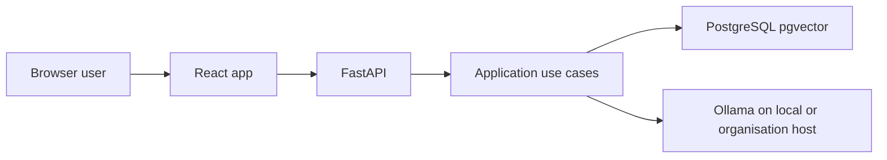
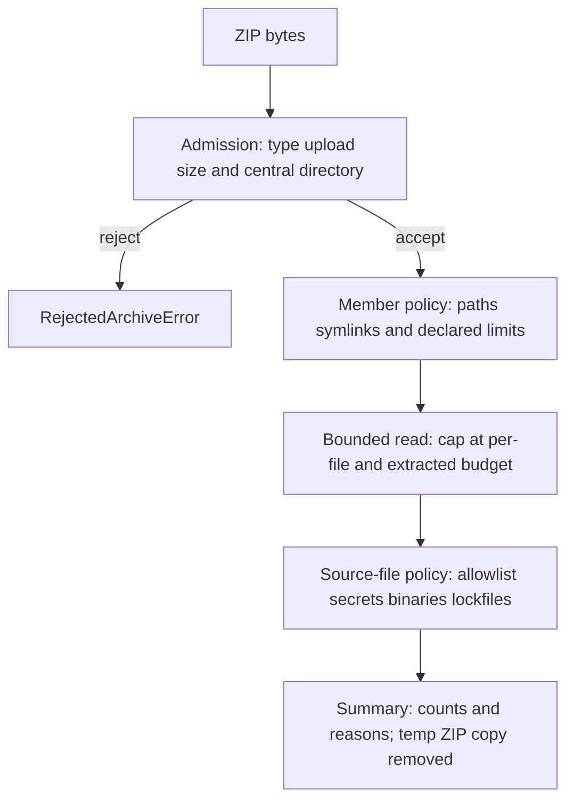

# Threat model

This document records trust boundaries and controls as they are decided. It is not a certification claim. Phase 3 will add archive-ingestion attacks in more detail.

## Assets

- Uploaded repository contents (private source in a real deployment).
- Retrieved chunks, constructed prompts and model output.
- Provider credentials, if any are ever introduced.
- Vector store contents scoped to a repository.

## Trust boundaries

- The browser and ZIP upload are untrusted.
- Application code is trusted to enforce policy.
- Ollama is trusted as an in-network inference process, not as a reason to skip citation checks or treat model text as authoritative.
- Hosted third-party LLM APIs are **outside** the intended trust boundary for repository analysis.
- The repository **card schema** (field names, counts, truncation flags, that `outline_paths` lists indexed paths) is application-derived. Copied repository strings on the card (`readme_excerpt`, manifest name/description, dependency names, endpoint paths, symbols) remain **untrusted data**, the same as retrieved excerpts. Do not treat the card as a trusted instruction source.

## LLM and embedding data handling

**Risk:** Sending private repository text to a hosted model API (training, logging, or retention outside the organisation).

**Control:** The approved runtime is local Ollama ([ADR 004](adr/004-ollama-local-inference.md)). Embeddings and completions for real runs stay on the local or organisation host. Default tests use fakes and do not call Ollama.

**Residual:**

- Source still exists in memory, logs (if misconfigured), PostgreSQL, and the Ollama process. Least-privilege host access still matters.
- Pulling model weights from Ollama’s library is a supply-chain event; it must not be confused with uploading the customer repo to that library.
- A future hosted-API adapter is forbidden unless a new ADR and data-handling approval exist.

## Other risks (tracked, not fully implemented)

These remain in scope for later phases; listing them here does not mean every residual is closed:

- Prompt injection in source comments and fabricated citations (controls + **6.5** / **9.5** regressions; models can still attempt injection in prose).
- Log leakage of source, prompts or credentials (Phase 10).

## Adversarial regression matrix (Phase 9.5)

**Risk:** Hostile uploads, secrets, injection, forged citations, oversized input, provider outages, or HTML injection of excerpts undermine trust.

**Control:** Consolidated automated coverage in `backend/tests/adversarial/test_matrix.py` (ZIP slip reject, secret ignore, injection/forgery → insufficient evidence, question budget, safe 503, same-name re-upload replaces the prior repository) plus frontend excerpt rendering as text (`frontend/tests/app/App.test.tsx`). Browser journey covered by Playwright (`make test-e2e`) against fake providers only.

**Residual:** Extractive completion quotes retrieved excerpts and now refuses unsupported IE-eval questions when content terms do not whole-word match. Ollama can still emit misleading prose. Escaped rendering does not sanitise server-side logs if logging is misconfigured later.
## Answer prompt and context budgets (Phase 6.1)

**Risk:** Oversized questions or retrieved context exhaust memory/provider cost, or untrusted excerpt text is treated as instructions.

**Control:** Prompts delimit sources, treat excerpt text as untrusted data, and ask for multi-paragraph grounded answers with inline `[n]` citations (not file names alone). `AnswerLimits` enforce `MAX_QUESTION_CHARS` (reject), `MAX_CONTEXT_CHARS` / `MAX_EXCERPT_CHARS` (truncate selection in retrieval order), and Ollama output is capped with `LLM_MAX_OUTPUT_TOKENS`. Citations are verified only against chunks that fit the budgeted prompt.

**Residual:** Character budgets are not token-accurate for every model. Malformed completion JSON degrades to insufficient evidence rather than raising to the client. Prompt-injection regressions (**6.5**) lock citation verification; they do not make the local model immune to following injected text in its prose.

## Constrained Markdown answer rendering (Phase 13.8b)

**Risk:** Repository excerpts or model output containing HTML, scripts, event handlers or image URLs could execute in the browser if treated as trusted Markdown/HTML.

**Control:** The chat uses a small in-repository Markdown parser that creates React elements for headings, paragraphs, simple lists, tables, inline code and fenced code blocks. Text remains escaped by React. Raw HTML is never parsed, `dangerouslySetInnerHTML` is not used, and fenced directory trees/tables render in bounded cards. Component regressions cover hostile `<script>` and `` strings remaining inert while citation buttons still work, including inside table cells.

**Residual:** This is intentionally not full CommonMark. Links, images, escaped pipes in tables, nested lists and other constructs render as plain text. Future Markdown features need explicit hostile-input tests before being enabled.

## Indexed file tree rendering

**Risk:** Indexed path strings come from the uploaded ZIP. A hostile filename could try to inject HTML or scripts if rendered as markup.

**Control:** The right-hand file panel and the mobile file drawer render path segments as React text. Filenames are split only for display (stem vs extension); the hover `title` is the full relative path. A component regression keeps `` path names as text.

**Residual:** The tree shows accepted indexed paths only, not ignored secret or lockfile members. Very large indexes are scrolled in the browser, not paginated.

## Vector store isolation (Phase 5)

**Risk:** Retrieval returning chunks from another uploaded repository.

**Control:** `PostgresWorkspace.search` always includes `WHERE repository_id = :repository_id`. Exact pin-path loads (`chunks_for_paths`) use the same repository filter and an expanding `file_path IN (...)` bind. Locate questions that name a long identifier may prepend matching chunks from a capped, same-repository path scan (at most 40 indexed files) when vector hits omit that identifier. Chunks are owned by `repositories.repository_id` with `ON DELETE CASCADE`. `DELETE /api/repositories/{id}` removes the repository row (chunks cascade). Re-uploading the same repository display name (ZIP basename, case-insensitive) deletes the prior repository before indexing the new one. Failed embedding marks the repository `failed` and does not save a `completed` summary. Questions against a non-completed repository return 409. Repository summaries may include an extractive `repository_card` JSON object built only from accepted members. Card **strings** copied from the ZIP stay untrusted; only schema/provenance is application-derived. Structure and endpoint answers can list outline/extracted routes from the card without a model call; those strings remain untrusted and citations still come from indexed chunks.

**Residual:** Without a database URL the API uses an in-process index. Default embeddings are hashed lexical vectors, not Ollama. Default completions are extractive (no model call). Operators who set `EMBEDDING_PROVIDER=ollama` and/or `COMPLETION_PROVIDER=ollama` send chunk text and prompts to the local Ollama process only. Existing Postgres databases need migration `004_repository_card`. The card stores accepted README/manifest excerpts, not ignored secret files. Copied card strings are delimited as untrusted data in the prompt; overview/endpoint/dependency questions return insufficient evidence when required extracted evidence is missing. Endpoint records include declaring file and line range; re-ingest older rows to populate them.

## ZIP ingestion (Phase 3)

The upload is untrusted. The application must never execute, import, compile or evaluate archive contents. Admission parses the ZIP directory without decompressing members. Expansion limits run on archive metadata before any member payload is inflated. Member bytes are then read with an explicit size cap.

| Attack | OWASP-aligned category | Control (admission now / later tasks) |
|---|---|---|
| Non-ZIP or truncated ZIP | A04 Insecure Design / A08 Integrity | Filename `.zip` and `ZipFile` central-directory parse |
| Oversized upload | A04 Insecure Design | `MAX_ARCHIVE_BYTES` (default 10 MiB) |
| ZIP slip (`../`, absolute paths) | A01 Broken Access Control | Member path policy (`validate_members`) |
| Symlink to host files | A01 Broken Access Control | Unix symlink members rejected |
| Zip bomb (ratio/size/count) | A04 Insecure Design | Metadata file-count, per-file, extracted-size and compression-ratio limits before any member inflate; `read_member_bounded` stops at those budgets. `ZipFile.testzip()` is not used |
| Secret files (`.env`, keys) | A01 / A04 | Name policy in `classify_source_file` (`.env*`, keys, credentials); contents never returned |
| Generated lockfiles and minified bundles | A04 Insecure Design | Basename/suffix policy (`generated_lockfile`, `generated_bundle`); contents never returned or embedded |
| Unsupported/binary files | A04 Insecure Design | Extension allowlist, NUL-byte and UTF-8 checks |
| Uploaded code as a module | A03 Injection | Never import/exec contents; members are read as bytes and classified |
| Leftover upload files | A01 / A04 | `TemporaryDirectory` for the ZIP copy; removed on success and failure |

**Residual:** Members are not extracted as files. A copy of the ZIP is written under a temp directory and always removed. The secret-name and generated-artefact lists are not exhaustive. Repositories ingested before this control still contain lockfile chunks until re-uploaded. Limits are configuration, not a guarantee against a determined local attacker with huge RAM. `ZipInfo` sizes can lie; the bounded read is the control that stops actual inflation. CRC is checked by `zipfile` only when a member is fully consumed within budget. Chunks persist in PostgreSQL when a database URL is configured; otherwise the index is in-process.

This is a control record, not a certification.
